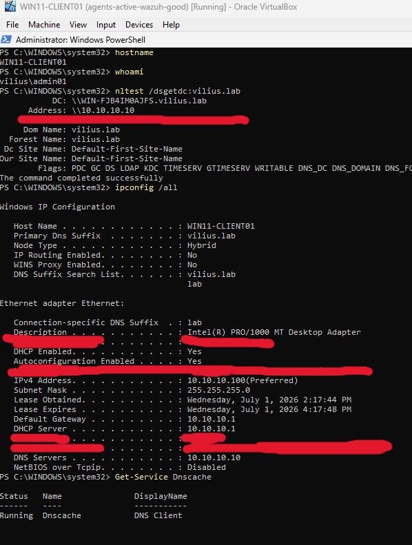
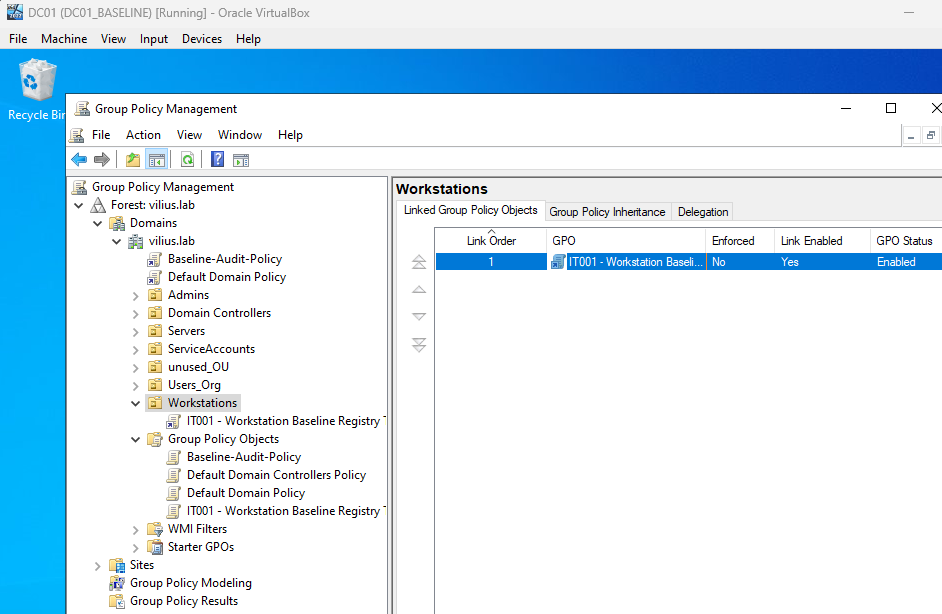
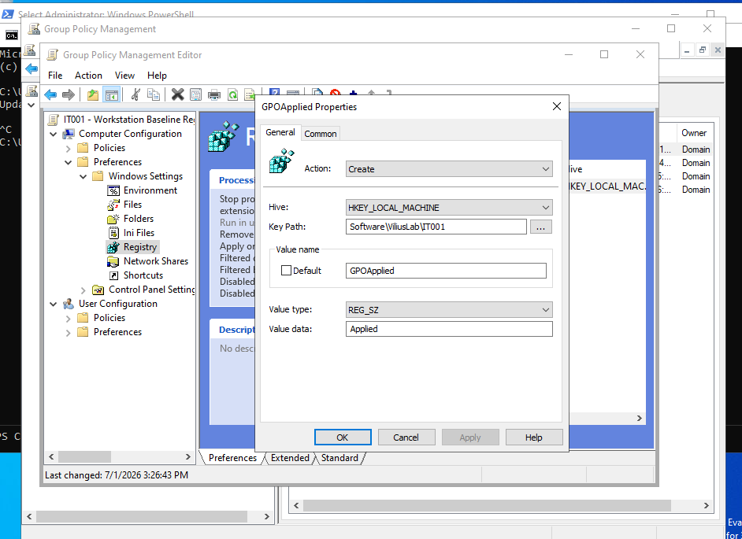
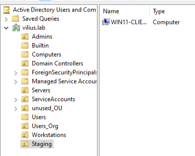
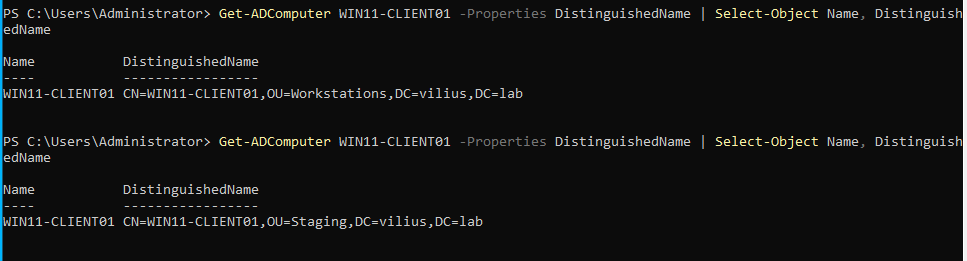
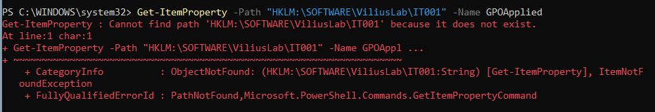
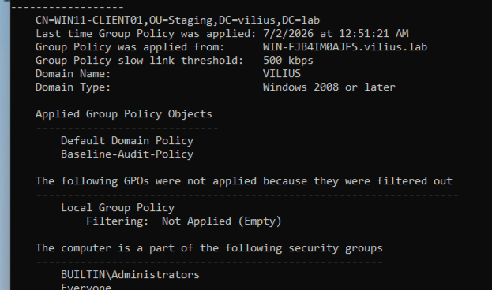
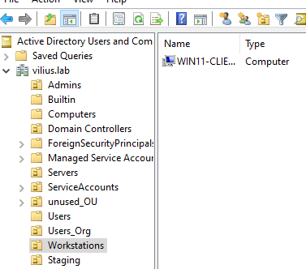
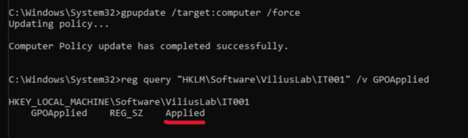
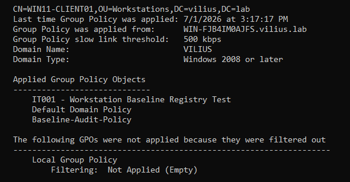

# Investigation: New Workstation Missing Standard Configuration

## Ticket Summary

A new workstation, `WIN11-CLIENT01`, was reported as missing standard workstation configuration during user onboarding.

The workstation was joined to the domain, domain sign-in was working, and network access appeared normal. However, one expected workstation baseline setting was missing.

In this lab scenario, the expected baseline setting was represented by a harmless registry value created through Group Policy:

```text
HKLM\SOFTWARE\ViliusLab\IT001
GPOApplied = Applied
```

This registry value was used only as a safe way to confirm whether the computer-side Group Policy setting applied successfully.

---

## Lab Environment

Systems involved:

- `DC01` - Domain Controller
- `WIN11-CLIENT01` - Windows client workstation
- Active Directory
- Group Policy Management
- Group Policy Preferences

Related lab documentation:

```text
Purple Team Home Lab documentation link placeholder
```

---

## Initial Checks

I first confirmed that `WIN11-CLIENT01` was healthy enough to process domain policy.

Checks performed on the client:

```powershell
hostname
whoami
nltest /dsgetdc:vilius.lab
ipconfig /all
Get-Service Dnscache
```

The workstation was confirmed to be domain joined, using the expected domain, and able to locate a domain controller.



This reduced the likelihood that the issue was caused by basic network failure, DNS failure, or the workstation not being joined to the domain.

---

## GPO Configuration

A test workstation baseline GPO was created and linked to the `Workstations` OU.

GPO name:

```text
IT001 - Workstation Baseline Registry Test
```

The GPO was linked to:

```text
OU=Workstations,DC=vilius,DC=lab
```



The GPO was configured to create the following registry value using Group Policy Preferences:

```text
Hive: HKEY_LOCAL_MACHINE
Key Path: Software\ViliusLab\IT001
Value name: GPOApplied
Value type: REG_SZ
Value data: Applied
```



This registry value represented the standard workstation configuration mentioned in the ticket.

---

## Reproducing the Issue

To reproduce the reported issue, `WIN11-CLIENT01` was moved out of the `Workstations` OU and placed into a separate `Staging` OU.

The `Staging` OU did not have the `IT001 - Workstation Baseline Registry Test` GPO linked to it.



The computer object's distinguished name was checked from the domain controller:

```powershell
Get-ADComputer WIN11-CLIENT01 -Properties DistinguishedName |
Select-Object Name, DistinguishedName
```

The output confirmed that the workstation was moved from the `Workstations` OU to the `Staging` OU.



---

## Reported Symptom Confirmed

After moving the workstation into the `Staging` OU, I checked whether the expected registry value existed on `WIN11-CLIENT01`.

Command used:

```powershell
Get-ItemProperty -Path "HKLM:\SOFTWARE\ViliusLab\IT001" -Name GPOApplied
```

The path did not exist, which confirmed that the expected baseline setting was missing.



This matched the ticket report: the workstation was domain joined and functional, but the standard workstation configuration was not present.

---

## Group Policy Investigation

Group Policy was refreshed on `WIN11-CLIENT01`.

```cmd
gpupdate /force
```

The applied computer policies were then checked:

```cmd
gpresult /r /scope computer
```

The expected GPO was not listed under applied computer policies.

Expected GPO:

```text
IT001 - Workstation Baseline Registry Test
```

Applied GPOs only showed domain-level policies, such as:

```text
Default Domain Policy
Baseline-Audit-Policy
```



This confirmed that the workstation was processing Group Policy, but it was not receiving the workstation baseline GPO.

The GPO itself existed and was linked to the `Workstations` OU, so the issue was not that the GPO was missing or disabled. The issue was related to where the computer object was located in Active Directory.

---

## Root Cause

`WIN11-CLIENT01` was located in the `Staging` OU instead of the `Workstations` OU.

The workstation baseline GPO was linked to the `Workstations` OU only. Because the computer object was outside that OU, the computer-side policy did not apply to `WIN11-CLIENT01`.

Root cause:

```text
The workstation computer object was outside the scope of the linked Group Policy Object.
```

---

## Fix

To resolve the issue, `WIN11-CLIENT01` was moved back into the correct `Workstations` OU.



Group Policy was then refreshed on the client:

```cmd
gpupdate /target:computer /force
```

The computer policy update completed successfully.

---

## Validation

After the workstation was moved back into the correct OU, the expected registry value was checked again.

Command used:

```cmd
reg query "HKLM\SOFTWARE\ViliusLab\IT001" /v GPOApplied
```

The registry value was present:

```text
HKEY_LOCAL_MACHINE\SOFTWARE\ViliusLab\IT001
    GPOApplied    REG_SZ    Applied
```



A final `gpresult` check confirmed that the workstation baseline GPO was now applied to `WIN11-CLIENT01`.

```cmd
gpresult /r /scope computer
```

The applied Group Policy Objects list included:

```text
IT001 - Workstation Baseline Registry Test
```



---

## Conclusion

The issue was resolved by moving `WIN11-CLIENT01` into the correct `Workstations` OU.

The workstation was domain joined and network connectivity was working, but the computer object was outside the scope of the workstation baseline GPO. After correcting the OU placement and refreshing Group Policy, the expected registry-based baseline setting was successfully applied.

This confirmed that the original issue was caused by incorrect Active Directory OU placement, not by workstation connectivity, domain join failure, or a missing GPO.

---

## Evidence Summary

| Evidence | Screenshot |
|---|---|
| Client confirmed domain joined and able to reach the domain controller | `screenshots/01-client-domain-connectivity-before-investigation.png` |
| Client placed in Staging OU | `screenshots/02-client-in-staging-ou.png` |
| GPO linked to the Workstations OU | `screenshots/03-gpo-linked-to-workstations-ou.png` |
| Registry preference configured in the GPO | `screenshots/04-gpo-registry-preference-configured.png` |
| Distinguished name confirmed OU change | `screenshots/05-adcomputer-distinguishedname-before-after-move.png` |
| gpresult showed IT001 GPO was not applied | `screenshots/06-gpresult-before-it001-not-applied.png` |
| Client moved back to Workstations OU | `screenshots/07-client-moved-back-to-workstation.png` |
| Registry value present after fix | `screenshots/08-registry-value-present-after-fix.png` |
| gpresult confirmed IT001 GPO applied | `screenshots/09-gpresult-after-it001-applied.png` |
| Registry value missing before fix | `screenshots/10-registry-value-missing-before-fix.png` |
