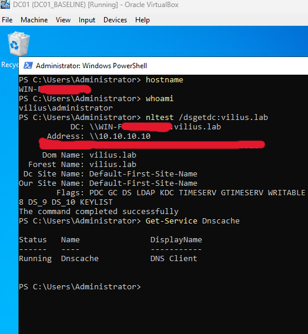
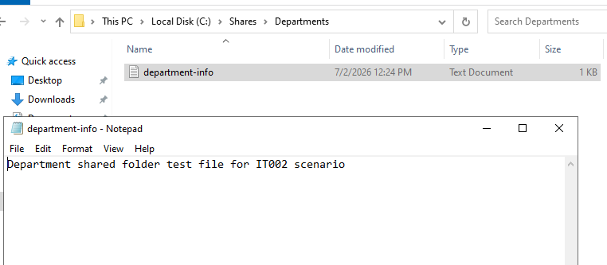
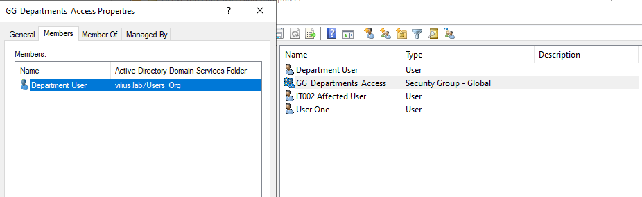
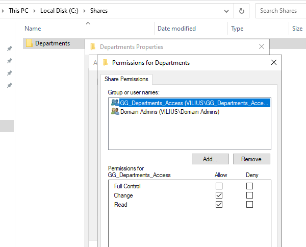
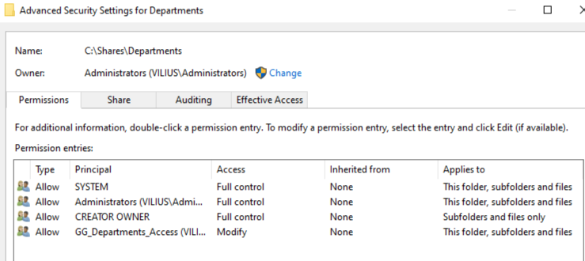
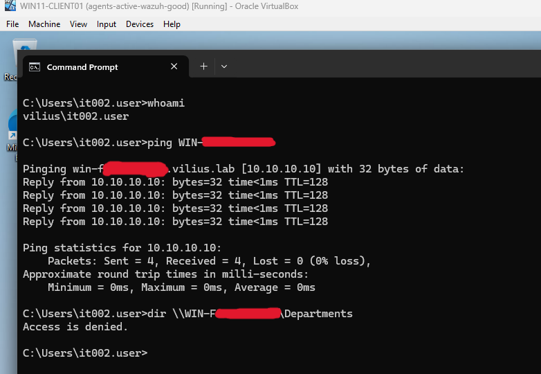
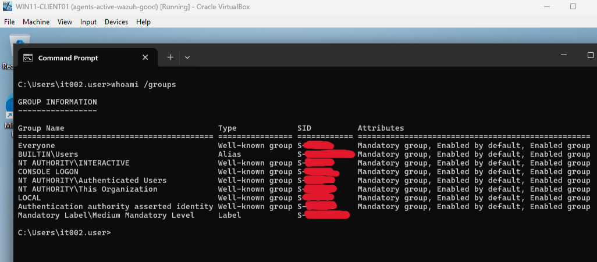
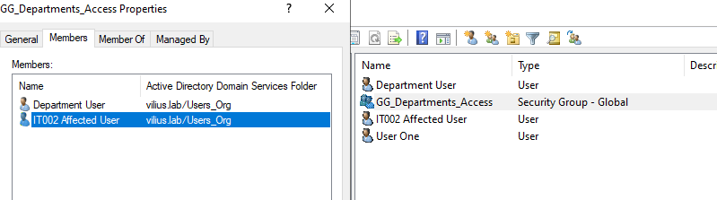
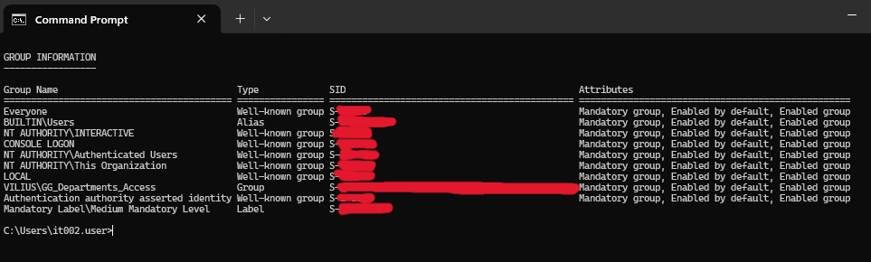
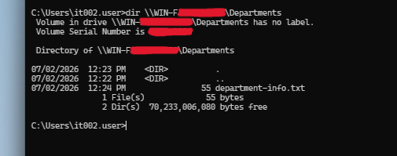

# Investigation: Unable to Access Department Shared Folder

## Ticket Summary

A user reported that they could not access the department shared folder from `WIN11-CLIENT01`.

The affected resource was:

```text
\\DC01\Departments
```

The user could sign in normally, network access appeared to be working, and other users were able to access the same shared folder. The issue appeared to affect one user rather than the shared folder itself.

In this lab scenario, `DC01` refers to the domain controller/file server role. The actual server hostname was redacted in screenshots.

---

## Lab Environment

Systems involved:

- `DC01` - Domain Controller and file server
- `WIN11-CLIENT01` - Windows client workstation
- Active Directory
- SMB file sharing
- NTFS permissions
- AD security group-based access control

Affected user:

```text
vilius\it002.user
```

Shared folder:

```text
\\DC01\Departments
```

Access group:

```text
GG_Departments_Access
```

Related lab documentation:

```text
Purple Team Home Lab documentation link placeholder
```

---

## Initial Checks

I first confirmed that the workstation and domain environment were healthy enough for normal domain access.

Checks performed:

```powershell
hostname
whoami
nltest /dsgetdc:vilius.lab
Get-Service Dnscache
```

The workstation/server was able to locate a domain controller, the domain was reachable, and the DNS Client service was running.



This reduced the likelihood that the issue was caused by a domain join problem, DNS failure, or general network connectivity issue.

---

## Shared Folder Setup

The department shared folder was created on the file server under:

```text
C:\Shares\Departments
```

A test file was placed inside the folder to validate access:

```text
department-info.txt
```



This file was used later to confirm whether the affected user could successfully read the share after the fix.

---

## Access Group Review

The shared folder was designed to use group-based access control.

The access group was:

```text
GG_Departments_Access
```

Before the fix, the group contained `department.user`, but the affected user `it002.user` was not a member.



This was important because the ticket stated that other users could access the share, but one user could not. That pointed toward a user-specific permissions or group membership issue.

---

## Share Permissions

The SMB share permissions were checked on the `Departments` share.

The share permissions allowed access through:

```text
GG_Departments_Access
```

The group had the required share-level permissions to access the folder.



This showed that the share itself was not broadly broken. Access depended on whether the user was a member of the required access group.

---

## NTFS Permissions

The NTFS permissions were also checked on:

```text
C:\Shares\Departments
```

The folder permissions allowed:

```text
GG_Departments_Access - Modify
Administrators - Full control
SYSTEM - Full control
CREATOR OWNER - Full control
```

Generic `Users` permissions were removed so that access was controlled through the intended department access group.



This confirmed that both SMB share permissions and NTFS permissions required the same access group.

---

## Reproducing the Issue

The affected user signed in on `WIN11-CLIENT01` as:

```text
vilius\it002.user
```

Basic connectivity to the server was confirmed using `ping`. The server responded successfully, which showed that the workstation could reach the file server.

The user then attempted to list the contents of the department share:

```cmd
dir \\DC01\Departments
```

The result was:

```text
Access is denied.
```



This confirmed the reported symptom. The client could reach the server, but access to the shared folder was denied.

---

## Group Membership Investigation

The affected user’s current logon token was checked with:

```cmd
whoami /groups
```

The expected access group was:

```text
VILIUS\GG_Departments_Access
```

Before the fix, this group was not present in the affected user’s group list.



This confirmed that the affected user’s current session did not include the group required to access the department share.

Because Windows evaluates access using the user’s current logon token, the missing group membership explained why access was denied.

---

## Root Cause

The affected user, `it002.user`, was not a member of the AD security group used to grant access to the department shared folder.

The share and NTFS permissions were configured for:

```text
GG_Departments_Access
```

However, the affected user’s logon token did not include that group.

Root cause:

```text
The affected user was missing the required AD security group membership for the department shared folder.
```

---

## Fix

To resolve the issue, `it002.user` was added to:

```text
GG_Departments_Access
```



After the group membership was updated, the user signed out and signed back in on `WIN11-CLIENT01`.

This step was required because new group memberships are added to the user’s logon token during sign-in.

---

## Validation

After signing back in, the affected user’s group membership was checked again:

```cmd
whoami /groups
```

The required group was now present:

```text
VILIUS\GG_Departments_Access
```



The user then tested access to the shared folder again:

```cmd
dir \\DC01\Departments
```

The share opened successfully and the test file was visible:

```text
department-info.txt
```



This confirmed that the user could now access the department shared folder successfully.

---

## Conclusion

The issue was resolved by adding `it002.user` to the correct AD security group, `GG_Departments_Access`.

The investigation confirmed that the workstation could reach the file server and that the shared folder permissions were configured correctly. The access denied error occurred because the affected user was not a member of the group used by the share and NTFS permissions.

After the user was added to the group and signed back in, the new group membership appeared in the user’s logon token and access to `\\DC01\Departments` worked successfully.

---

## Evidence Summary

| Evidence | Screenshot |
|---|---|
| Domain and client connectivity confirmed | `screenshots/01-client-domain-connectivity-before-investigation.png` |
| Department shared folder and test file created | `screenshots/02-departments-folder-created-on-dc01.png` |
| Access group before fix showed affected user missing | `screenshots/03-access-group-before-fix-affected-user-missing.png` |
| Share permissions used `GG_Departments_Access` | `screenshots/04-share-permissions-configured.png` |
| NTFS permissions used `GG_Departments_Access` | `screenshots/05-ntfs-permissions-configured.png` |
| Affected user received Access Denied | `screenshots/06-access-denied-before-fix.png` |
| Affected user’s logon token did not include the access group | `screenshots/07-whoami-groups-before-fix-access-group-missing.png` |
| Affected user was added to the access group | `screenshots/08-user-added-to-departments-access-group.png` |
| New logon token included the access group | `screenshots/09-whoami-groups-after-fix-access-group-present.png` |
| Share access succeeded after fix | `screenshots/10-share-access-success-after-fix.png` |
