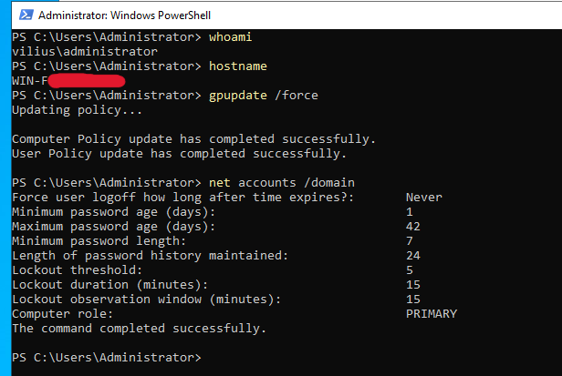
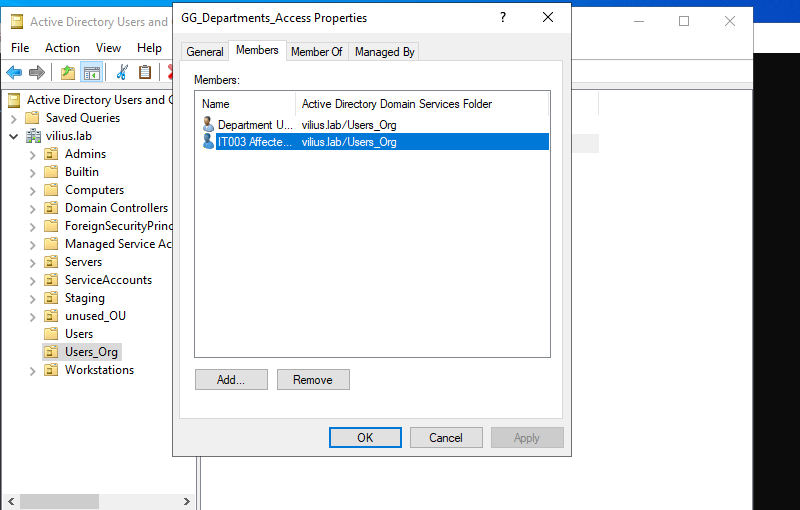
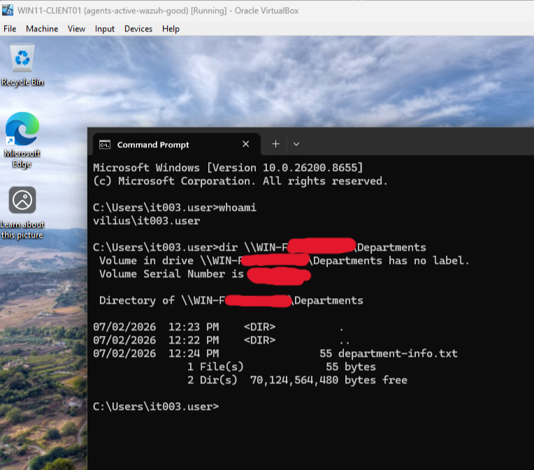
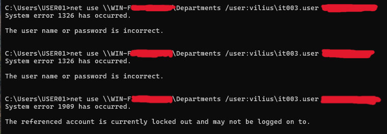
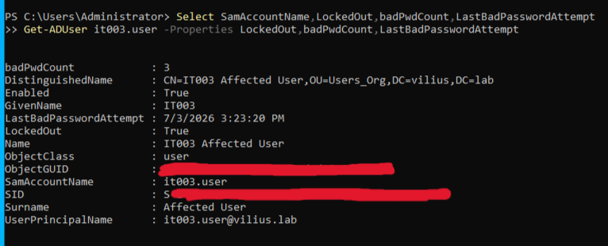
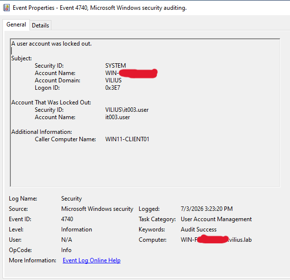
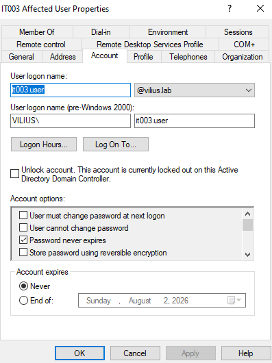

# Investigation: User Account Keeps Locking Out

## Ticket Summary

A user reported that their domain account kept locking out during the workday.

Affected user:

```text
vilius\it003.user
```

Affected device:

```text
WIN11-CLIENT01
```

The user was able to sign in after the account was unlocked, but the account locked again after a short time. No other users were reporting the same issue, so the investigation focused on the affected user account and the workstation associated with the repeated lockouts.

In this lab scenario, `DC01` refers to the domain controller role. The actual server hostname was redacted in screenshots.

---

## Lab Environment

Systems involved:

- `DC01` - Domain Controller
- `WIN11-CLIENT01` - Windows client workstation
- Active Directory
- Domain account lockout policy
- Windows Security Event Logs
- SMB authentication testing

Affected user:

```text
vilius\it003.user
```
Related lab:

This scenario was reproduced in my local Windows domain home lab using DC01, WIN11-CLIENT01, Active Directory, Group Policy, DNS, DHCP, and pfSense.

---

## Lockout Policy Review

I first confirmed that the domain had an account lockout policy configured.

Command used:

```cmd
net accounts /domain
```

Relevant policy settings:

```text
Lockout threshold: 5
Lockout duration: 15 minutes
Lockout observation window: 15 minutes
```



This confirmed that repeated failed authentication attempts could lock the account.

---

## User Access Baseline

The affected user, `it003.user`, was confirmed as a valid domain user and was added to the required department access group.

Access group:

```text
GG_Departments_Access
```



This confirmed that the user should normally be able to access the department share when the account is not locked and valid credentials are used.

---

## Reproducing the Issue

To reproduce the issue, failed SMB authentication attempts were generated from `WIN11-CLIENT01` using the affected account.

The test represented a realistic stale authentication source, such as:

- saved Windows credentials
- an old mapped drive credential
- a script or shortcut using an outdated password
- a background authentication attempt from the workstation

The failed authentication attempts returned:

```text
System error 1326 has occurred.
The user name or password is incorrect.
```

After several failed attempts, the account returned:

```text
System error 1909 has occurred.
The referenced account is currently locked out and may not be logged on to.
```



This reproduced the reported symptom: the account became locked after repeated authentication failures.

---

## Account Lockout Confirmation

The account lockout was confirmed in Active Directory Users and Computers.

The affected user account showed:

```text
Unlock account. This account is currently locked out on this Active Directory Domain Controller.
```



The account state was also checked with PowerShell on the domain controller.

Command used:

```powershell
Get-ADUser it003.user -Properties LockedOut,badPwdCount,LastBadPasswordAttempt |
Select-Object SamAccountName,LockedOut,badPwdCount,LastBadPasswordAttempt
```

The output confirmed:

```text
LockedOut: True
badPwdCount: 3
```



This confirmed that the issue was an actual domain account lockout, not just a local sign-in or workstation issue.

---

## Lockout Source Investigation

The domain controller Security log was checked for account lockout events.

Event checked:

```text
Event ID 4740 - A user account was locked out
```

The event showed:

```text
Account Name: it003.user
Caller Computer Name: WIN11-CLIENT01
```



This was the key investigation finding. The lockout was being triggered from `WIN11-CLIENT01`.

Because the lockout source was the affected workstation, the most likely cause was a stale or incorrect credential being submitted from that device.

---

## Root Cause

The account `vilius\it003.user` was repeatedly locking because `WIN11-CLIENT01` was submitting failed authentication attempts for that account.

The behavior was consistent with a stale credential or authentication source on the workstation, such as a saved Windows credential, mapped drive, script, or background SMB connection using an old password.

Root cause:

```text
WIN11-CLIENT01 was repeatedly attempting to authenticate as vilius\it003.user with an incorrect password, causing the domain account to lock out.
```

---

## Fix

The stale authentication source on `WIN11-CLIENT01` was cleared and the affected account was unlocked.

Remediation actions:

- Removed or cleared the incorrect authentication attempt from the workstation
- Cleared existing SMB sessions where needed
- Unlocked `it003.user` in Active Directory
- Had the user sign in again with the correct password

Example command used to clear SMB sessions:

```cmd
net use * /delete /y
```

The account was then unlocked from Active Directory Users and Computers.

---

## Validation

After the account was unlocked and the incorrect authentication source was cleared, the user signed in again on `WIN11-CLIENT01`.

The user was able to access the department shared folder successfully:

```cmd
dir \\DC01\Departments
```

The expected file was visible:

```text
department-info.txt
```



This confirmed that the account was usable again and that valid authentication from the workstation worked after the lockout source was removed.

---

## Conclusion

The issue was resolved by identifying `WIN11-CLIENT01` as the source of the repeated failed authentication attempts and clearing the incorrect authentication source from the workstation.

The account lockout was confirmed in Active Directory and by PowerShell. The domain controller Security log provided the key evidence by showing Event ID `4740`, with `WIN11-CLIENT01` listed as the caller computer.

After the stale authentication source was removed and the account was unlocked, `it003.user` was able to access domain resources successfully.

---

## Evidence Summary

| Evidence | Screenshot |
|---|---|
| Domain account lockout policy confirmed | `screenshots/01-domain-lockout-policy-confirmed.png` |
| Affected user confirmed as valid department access user | `screenshots/02-it003-user-added-to-access-group.png` |
| Failed authentication attempts reproduced account lockout | `screenshots/03-failed-authentication-attempts-account-lockout.png` |
| Account shown as locked in Active Directory Users and Computers | `screenshots/04-account-locked-in-aduc.png` |
| PowerShell confirmed account lockout state | `screenshots/05-account-locked-powershell-confirmation.png` |
| Event ID 4740 identified WIN11-CLIENT01 as the lockout source | `screenshots/06-event-4740-lockout-source-win11-client.png` |
| User successfully accessed department share after fix | `screenshots/07-share-access-success-after-fix.png` |
