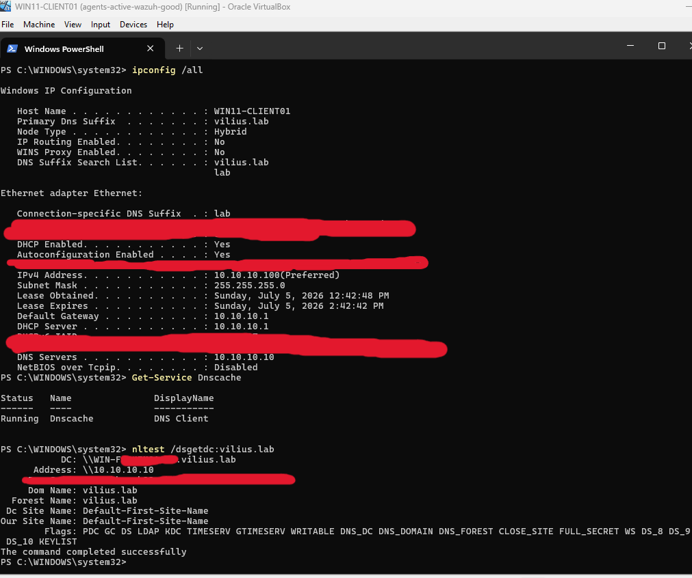
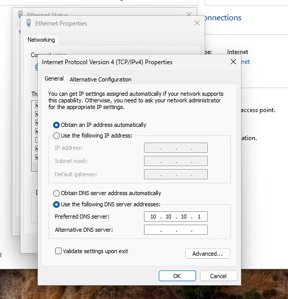
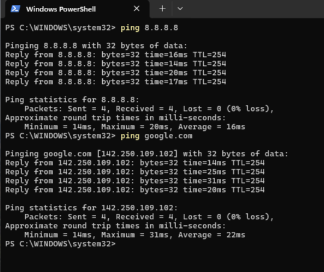
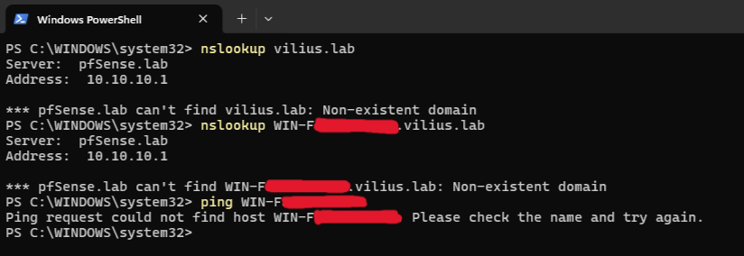
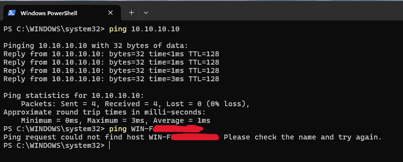
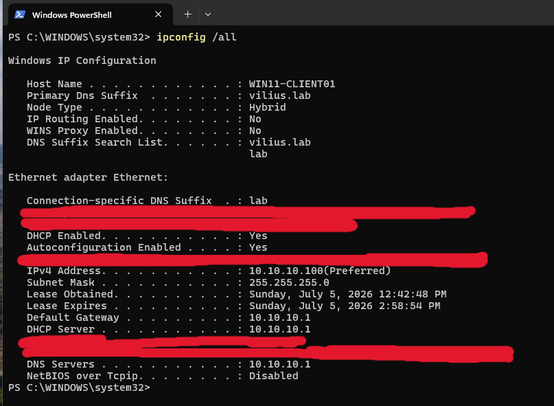
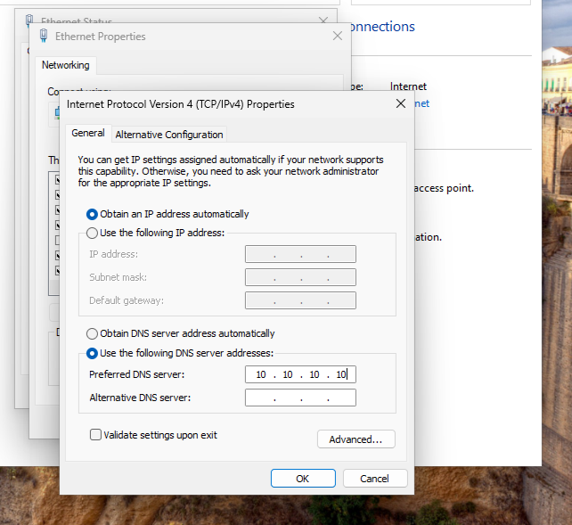
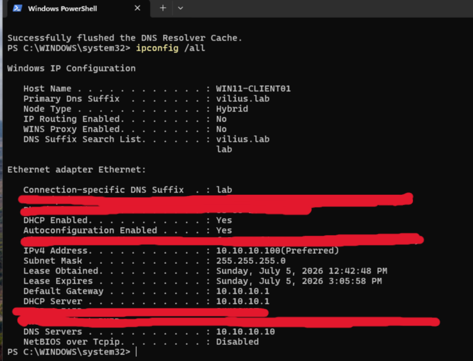
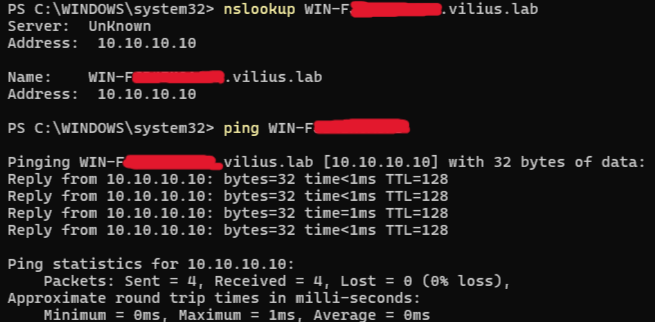

# Investigation: Unable to Access Internal Resources by Name

## Ticket Summary

A user reported that `WIN11-CLIENT01` was having trouble accessing internal company resources by name.

The workstation was connected to the network and internet access appeared to be working, but internal resources failed when accessed by hostname or internal domain name.

Affected device:

```text
WIN11-CLIENT01
```

Affected resource:

```text
Internal domain resources
```

The issue appeared limited to one workstation, so the investigation focused on local network and DNS configuration on `WIN11-CLIENT01`.

In this lab scenario, `DC01` refers to the domain controller and internal DNS server role. The actual server hostname was redacted in screenshots.

---

## Lab Environment

Systems involved:

- `DC01` - Domain Controller and internal DNS server
- `WIN11-CLIENT01` - Windows client workstation
- pfSense - gateway / non-AD DNS source
- Active Directory DNS
- Windows DNS Client service

Relevant IP addresses:

```text
AD DNS / DC01: 10.10.10.10
pfSense / Gateway: 10.10.10.1
WIN11-CLIENT01: 10.10.10.100
```

Related lab documentation:

```text
Purple Team Home Lab documentation link placeholder
```

---

## Initial Checks

I first confirmed that `WIN11-CLIENT01` was domain joined and healthy enough to perform normal domain communication.

Checks performed:

```powershell
ipconfig /all
Get-Service Dnscache
nltest /dsgetdc:vilius.lab
```

The workstation was joined to the `vilius.lab` domain, the DNS Client service was running, and the workstation could locate a domain controller.



This confirmed that the workstation itself was online and not generally disconnected from the domain environment.

---

## Reproducing the Issue

To reproduce the reported symptoms, the workstation DNS configuration was changed so that `WIN11-CLIENT01` used pfSense as its DNS server instead of the AD DNS server.

Broken DNS configuration:

```text
Preferred DNS server: 10.10.10.1
```

Expected AD DNS configuration:

```text
Preferred DNS server: 10.10.10.10
```



This reproduced a common workstation issue where internet access can still work, but internal Active Directory DNS names fail.

---

## Internet Connectivity Test

After changing the DNS server, I confirmed that general internet connectivity still worked.

Commands used:

```powershell
ping 8.8.8.8
ping google.com
```

Both tests succeeded.



This matched the ticket report: the workstation appeared to have network and internet access, but internal resources were still failing by name.

---

## Internal Name Resolution Test

Next, I tested internal DNS resolution.

Commands used:

```powershell
nslookup vilius.lab
nslookup <dc-hostname>.vilius.lab
ping <dc-hostname>
```

The workstation was using pfSense as its DNS server:

```text
Server: pfSense.lab
Address: 10.10.10.1
```

Internal domain lookups failed with non-existent domain responses, and ping by hostname failed.



This confirmed that the issue was related to internal name resolution.

---

## IP Connectivity vs Name Resolution

To separate network connectivity from DNS resolution, I tested the domain controller by IP address and by hostname.

Commands used:

```powershell
ping 10.10.10.10
ping <dc-hostname>
```

The ping by IP address succeeded, but the ping by hostname failed.



This was an important finding. It showed that the workstation could reach the domain controller over the network, but could not resolve the internal hostname correctly.

The issue was not basic network connectivity. It was DNS resolution.

---

## DNS Configuration Review

The workstation network configuration was reviewed with:

```powershell
ipconfig /all
```

The output showed that `WIN11-CLIENT01` was using the wrong DNS server:

```text
DNS Servers . . . . . . . . . . . : 10.10.10.1
```



This confirmed the root cause. The workstation was using pfSense / gateway DNS instead of the AD DNS server.

---

## Root Cause

`WIN11-CLIENT01` was configured to use the wrong DNS server.

The workstation was using:

```text
10.10.10.1
```

instead of the internal AD DNS server:

```text
10.10.10.10
```

Because Active Directory domain resources depend on internal DNS records, the workstation could still reach the network and internet, but internal domain names failed or became unreliable.

Root cause:

```text
WIN11-CLIENT01 was using pfSense/gateway DNS instead of the AD DNS server, causing internal domain name resolution to fail.
```

---

## Fix

The DNS configuration on `WIN11-CLIENT01` was corrected.

The preferred DNS server was changed from:

```text
10.10.10.1
```

to:

```text
10.10.10.10
```



After changing the DNS server, the DNS resolver cache was flushed:

```powershell
ipconfig /flushdns
```

The updated network configuration was checked again:

```powershell
ipconfig /all
```

The workstation now showed the correct DNS server:

```text
DNS Servers . . . . . . . . . . . : 10.10.10.10
```



---

## Validation

After correcting DNS, internal name resolution was tested again.

Commands used:

```powershell
nslookup <dc-hostname>.vilius.lab
ping <dc-hostname>
```

The internal hostname resolved successfully to the domain controller IP address, and ping by hostname succeeded.



This confirmed that internal DNS resolution was working again after the workstation was pointed back to the AD DNS server.

---

## Conclusion

The issue was resolved by correcting the DNS server configured on `WIN11-CLIENT01`.

The workstation had working network and internet connectivity, but it was using pfSense/gateway DNS instead of the internal AD DNS server. Because of this, internal domain resources could not be resolved by name.

After changing the DNS server to the domain controller / AD DNS server and flushing the DNS cache, internal domain name resolution worked successfully.

---

## Evidence Summary

| Evidence | Screenshot |
|---|---|
| Initial domain connectivity and DNS Client service confirmed | `screenshots/01-client-domain-connectivity-before-investigation.png` |
| DNS intentionally set to wrong server | `screenshots/02-client-dns-set-to-wrong-server.png` |
| Internet connectivity still worked | `screenshots/03-internet-connectivity-still-working.png` |
| Internal DNS lookups failed through pfSense DNS | `screenshots/04-internal-name-resolution-fails.png` |
| Domain controller reachable by IP but not by hostname | `screenshots/05-ip-connectivity-works-name-resolution-fails.png` |
| `ipconfig /all` confirmed wrong DNS server | `screenshots/06-ipconfig-shows-wrong-dns-server.png` |
| DNS corrected to AD DNS server | `screenshots/07-client-dns-corrected-to-ad-dns.png` |
| `ipconfig /all` confirmed correct DNS server | `screenshots/08-ipconfig-shows-correct-dns-server.png` |
| Internal name resolution worked after fix | `screenshots/09-internal-name-resolution-working-after-fix.png` |
