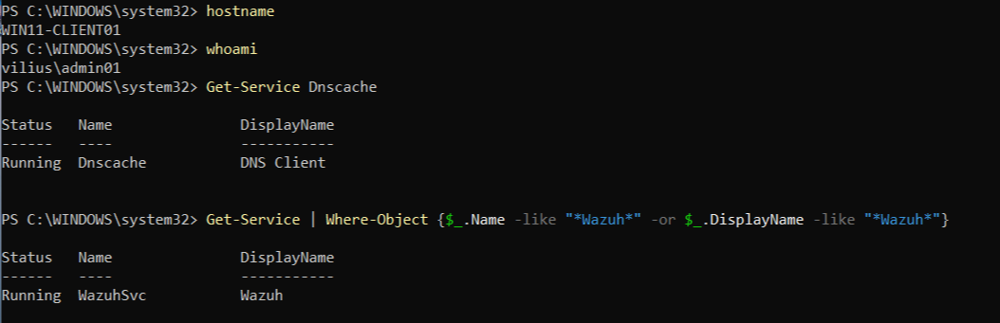
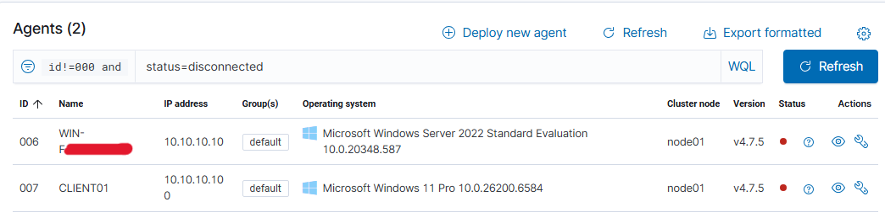
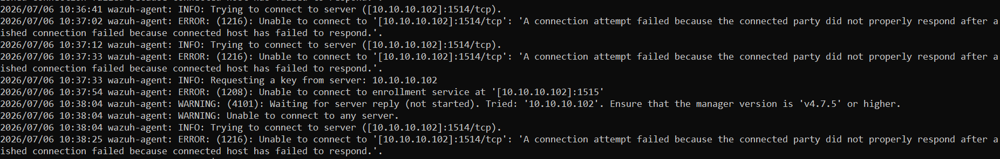
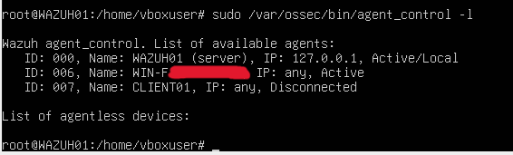
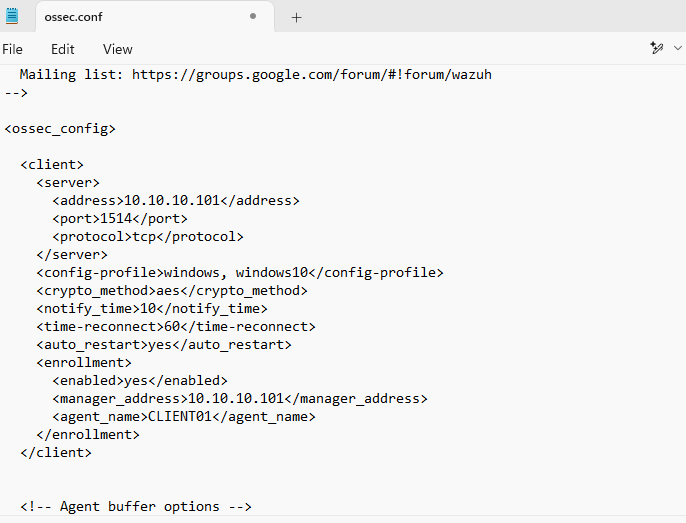
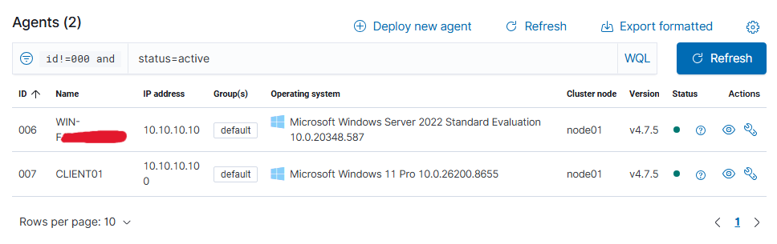

# Investigation: Endpoint Monitoring Agent Not Reporting

## Ticket Summary

`WIN11-CLIENT01` was reported as disconnected in the endpoint monitoring dashboard.

The workstation appeared to be online and no user-facing outage was reported, but Wazuh was not receiving recent agent check-ins from the endpoint.

Affected device:

```text
WIN11-CLIENT01
```

Affected system:

```text
Wazuh / Endpoint monitoring
```

The investigation focused on checking whether the endpoint was online, whether the Wazuh agent service was running, and whether the agent was configured to communicate with the correct Wazuh manager.

---

## Lab Environment

Systems involved:

- `WIN11-CLIENT01` - affected Windows client
- `DC01` - domain controller / comparison endpoint
- `WAZUH01` - Wazuh manager and dashboard server
- Wazuh agent service on Windows endpoints

Relevant IP addresses:

```text
Current Wazuh manager IP: 10.10.10.101
Old Wazuh manager IP:     10.10.10.102
```

In this lab, `DC01` refers to the domain controller role. Some hostnames were redacted in screenshots.

---

## Initial Workstation Check

I first confirmed that `WIN11-CLIENT01` was online and that the Wazuh agent service was installed and running.

Commands used:

```powershell
hostname
whoami
Get-Service Dnscache
Get-Service | Where-Object {$_.Name -like "*Wazuh*" -or $_.DisplayName -like "*Wazuh*"}
```

The workstation returned the expected hostname, the DNS Client service was running, and the Wazuh service was also running.



This showed that the workstation itself was not offline and that the Wazuh agent service was present and running locally.

---

## Dashboard Symptom

The Wazuh dashboard showed monitored agents as disconnected.



This confirmed the reported monitoring issue. The endpoint was listed in Wazuh, but it was not currently reporting as active.

Because more than one agent initially appeared disconnected, I checked the Wazuh manager and endpoint configuration to determine whether the issue was related to service state, connectivity, or agent configuration.

---

## Agent Log Review

I reviewed the local Wazuh agent log on `WIN11-CLIENT01`.

Log path:

```text
C:\Program Files (x86)\ossec-agent\ossec.log
```

The log showed repeated connection attempts to the old Wazuh manager IP address:

```text
10.10.10.102
```

The agent was attempting to connect to:

```text
10.10.10.102:1514/tcp
10.10.10.102:1515
```

The connection attempts failed because the Wazuh manager was no longer available at that address.



This was the main finding. The Wazuh service was running, but it was attempting to report to the wrong manager IP address.

---

## Wazuh Manager Agent Status

I also checked the agent status directly from the Wazuh server using:

```bash
sudo /var/ossec/bin/agent_control -l
```

After restoring the comparison endpoint, `DC01` was active while `CLIENT01` remained disconnected.



This confirmed that the remaining issue was isolated to `WIN11-CLIENT01`.

---

## Root Cause

`WIN11-CLIENT01` was not reporting because its Wazuh agent configuration still referenced an old Wazuh manager IP address.

Old manager IP:

```text
10.10.10.102
```

Current Wazuh manager IP:

```text
10.10.10.101
```

Although the Wazuh service was installed and running, the agent was trying to communicate with the wrong manager address. As a result, Wazuh did not receive check-ins from the endpoint and showed it as disconnected.

Root cause:

```text
WIN11-CLIENT01 had a stale Wazuh manager IP address configured in ossec.conf.
```

---

## Fix

The Wazuh agent configuration file was updated on `WIN11-CLIENT01`.

Configuration file:

```text
C:\Program Files (x86)\ossec-agent\ossec.conf
```

The old manager IP was replaced with the current Wazuh server IP.

Corrected configuration:

```xml
<address>10.10.10.101</address>
<port>1514</port>
<protocol>tcp</protocol>
<manager_address>10.10.10.101</manager_address>
```



After updating the configuration, the Wazuh agent service was restarted so the new manager address would be used.

Commands used:

```powershell
Stop-Service WazuhSvc
Start-Service WazuhSvc
Get-Service WazuhSvc
```

---

## Validation

After the configuration was corrected and the Wazuh service was restarted, the Wazuh dashboard was checked again.

Both monitored Windows agents were active, including `CLIENT01`.



This confirmed that `WIN11-CLIENT01` resumed reporting after the Wazuh manager IP address was corrected.

---

## Conclusion

The issue was resolved by correcting the Wazuh manager IP address in the local agent configuration on `WIN11-CLIENT01`.

The workstation was online and the Wazuh service was running, but the agent was still configured to report to an old Wazuh manager IP address. Because of this, the endpoint could not check in successfully and appeared disconnected in the Wazuh dashboard.

After updating `ossec.conf` to use the current Wazuh manager IP and restarting `WazuhSvc`, the endpoint returned to active status.

---

## Evidence Summary

| Evidence | Screenshot |
|---|---|
| `WIN11-CLIENT01` was online and Wazuh service was running | `screenshots/01-client-wazuh-service-running-before-fix.png` |
| Wazuh dashboard showed agents disconnected | `screenshots/02-dashboard-agents-disconnected-before-fix.png` |
| Agent log showed connection failures to old manager IP `10.10.10.102` | `screenshots/03-agent-log-shows-old-manager-ip-failures.png` |
| Wazuh manager showed `DC01` active and `CLIENT01` disconnected | `screenshots/04-wazuh-manager-client01-disconnected-dc01-active.png` |
| Agent configuration updated to current manager IP `10.10.10.101` | `screenshots/05-agent-config-updated-to-current-manager-ip.png` |
| Wazuh dashboard showed agents active after the fix | `screenshots/06-dashboard-agents-active-after-fix.png` |
