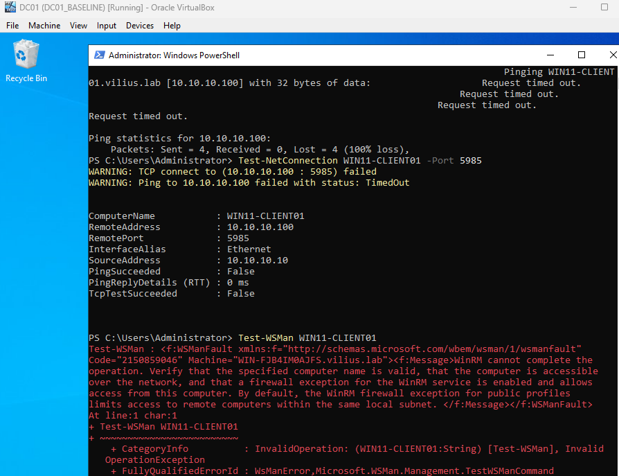
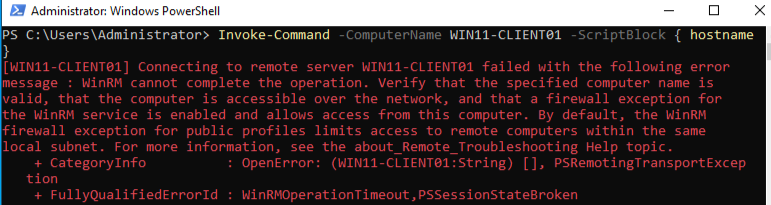
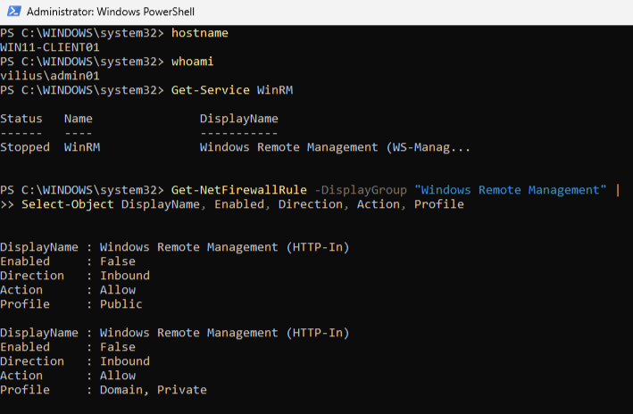
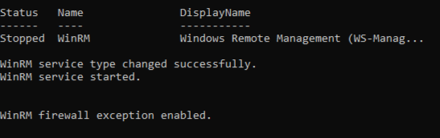
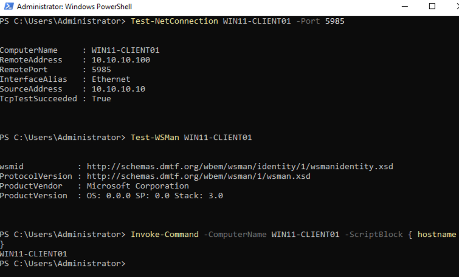

# Investigation: Remote PowerShell Connection Fails to Workstation

## Ticket Summary

IT Support reported that Remote PowerShell connections to `WIN11-CLIENT01` were failing.

The workstation appeared to be online and the user had not reported any local workstation issue, but IT could not connect using standard remote administration tools. The issue appeared limited to `WIN11-CLIENT01`, while other workstations could still be managed remotely. The ticket requested verification of network reachability, WinRM, Remote PowerShell, and related firewall configuration. 

Affected device:

`WIN11-CLIENT01`

Affected service:

`WinRM / Remote PowerShell`

Category:

`Remote Administration`

---

## Lab Environment

Systems involved:

* `DC01` - admin workstation / domain controller used to test remote administration
* `WIN11-CLIENT01` - affected Windows workstation
* Windows Remote Management service
* PowerShell Remoting
* Windows Firewall WinRM rules

In this lab, `DC01` refers to the domain controller/admin role. Some hostnames may be redacted in screenshots.

---

## Initial Remote Connection Test

I first tested Remote PowerShell connectivity from the admin machine to `WIN11-CLIENT01`.

Commands used:

`ping WIN11-CLIENT01`

`Test-NetConnection WIN11-CLIENT01 -Port 5985`

`Test-WSMan WIN11-CLIENT01`

The WinRM port test failed, and `Test-WSMan` returned a WinRM connection error.

This confirmed that Remote PowerShell was not working from the admin side.

---

## Remote Command Test

I also tested a basic remote command using PowerShell remoting:

`Invoke-Command -ComputerName WIN11-CLIENT01 -ScriptBlock { hostname }`

The command failed with a WinRM connection error.

This confirmed the reported symptom: IT could not remotely run PowerShell commands against `WIN11-CLIENT01`.

---

## Local Client Investigation

Next, I checked the affected workstation locally.

Commands used on `WIN11-CLIENT01`:

`hostname`

`whoami`

`Get-Service WinRM`

`Get-NetFirewallRule -DisplayGroup "Windows Remote Management" | Select-Object DisplayName, Enabled, Direction, Action, Profile`

The workstation was accessible locally, but the WinRM service was stopped.

The Windows Remote Management firewall rules were also disabled.

This explained why Remote PowerShell connections were failing. The workstation itself was usable locally, but the remote management service and related firewall exception were not active.

---

## Root Cause

`WIN11-CLIENT01` could not be managed using Remote PowerShell because Windows Remote Management was not properly enabled on the workstation.

Findings:

* `WinRM` service was stopped
* Windows Remote Management firewall rules were disabled
* Remote PowerShell commands from the admin machine failed
* Port `5985` was not accepting connections before the fix

Root cause:

`WinRM was stopped and the Windows Remote Management firewall exception was disabled on WIN11-CLIENT01.`

---

## Fix

I enabled PowerShell remoting on `WIN11-CLIENT01`.

The fix started the WinRM service, updated the service startup configuration, and enabled the required firewall exception.

Command used:

`Enable-PSRemoting -Force`

The output confirmed:

* WinRM service type changed successfully
* WinRM service started
* WinRM firewall exception enabled

---

## Validation

After enabling WinRM and the firewall exception, I retested Remote PowerShell from the admin machine.

Commands used:

`Test-NetConnection WIN11-CLIENT01 -Port 5985`

`Test-WSMan WIN11-CLIENT01`

`Invoke-Command -ComputerName WIN11-CLIENT01 -ScriptBlock { hostname }`

The port test succeeded, `Test-WSMan` returned a valid response, and `Invoke-Command` successfully returned the hostname of `WIN11-CLIENT01`.

This confirmed that Remote PowerShell access was restored.

---

## Conclusion

The issue was resolved by enabling Windows Remote Management on `WIN11-CLIENT01`.

The workstation was usable locally, but Remote PowerShell failed because WinRM was stopped and the Windows Remote Management firewall rules were disabled. After enabling PowerShell remoting, the WinRM service started, the firewall exception was enabled, and remote commands from the admin machine succeeded.

---

## Evidence Summary

| Evidence                                                     | Screenshot                                                                |
| ------------------------------------------------------------ | ------------------------------------------------------------------------- |
| Remote WinRM connection failed from admin machine            | `screenshots/01-remote-powershell-connection-fails-before-fix.png`        |
| `Invoke-Command` failed before remediation                   | `screenshots/02-invoke-command-fails-before-fix.png`                      |
| Local check showed WinRM stopped and firewall rules disabled | `screenshots/03-client-winrm-service-stopped-firewall-rules-disabled.png` |
| WinRM service started and firewall exception enabled         | `screenshots/04-winrm-service-started-firewall-exception-enabled.png`     |
| Remote PowerShell connection succeeded after fix             | `screenshots/05-remote-powershell-success-after-fix.png`                  |
