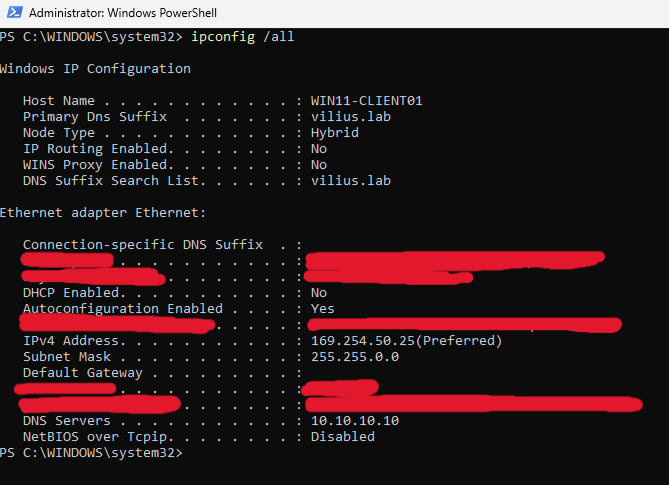
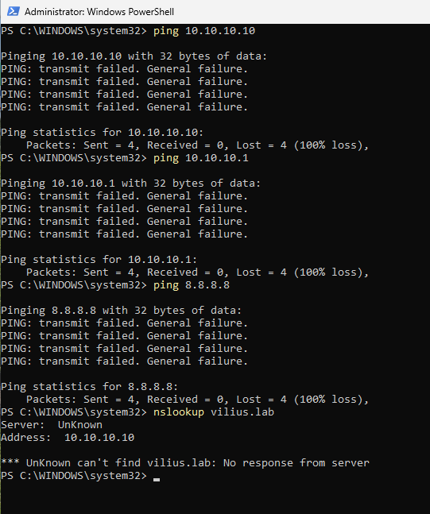
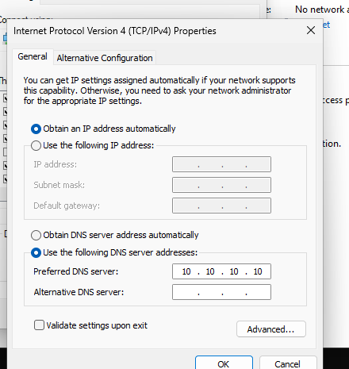
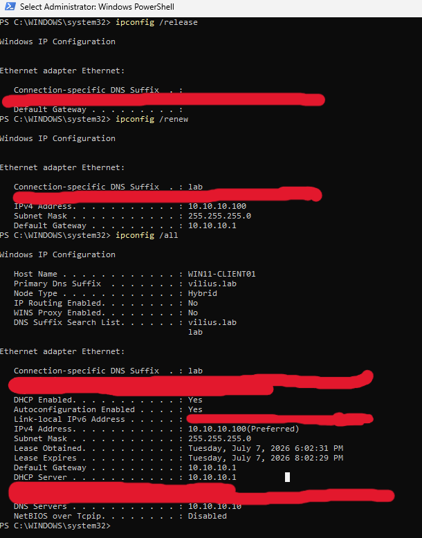
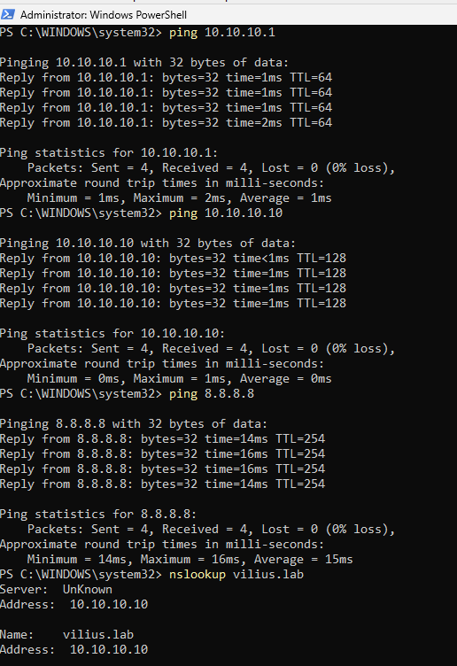
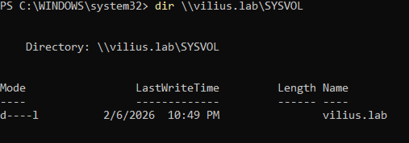

# Investigation: Workstation Has No Network Access

## Ticket Summary

A user reported that `WIN11-CLIENT01` had no network access after signing in.

The user could log in to Windows, but could not access internal resources, shared folders, or the internet. The issue appeared limited to this workstation, while other workstations were working normally.

Affected device:

`WIN11-CLIENT01`

Affected resource:

`Network connectivity`

Category:

`DHCP / Networking`

The investigation focused on checking whether the workstation had a valid IP address, default gateway, DNS configuration, and DHCP lease.

---

## Lab Environment

Systems involved:

* `WIN11-CLIENT01` - affected workstation
* `DC01` - domain controller / internal DNS server
* pfSense - DHCP server / default gateway
* Internal domain: `vilius.lab`

Relevant IP addresses:

* Expected workstation subnet: `10.10.10.0/24`
* Default gateway / DHCP server: `10.10.10.1`
* Internal DNS / domain controller: `10.10.10.10`

---

## Initial Network Configuration Check

I first checked the workstation network configuration with `ipconfig /all`.

The workstation had a link-local/APIPA-style address:

`169.254.50.25`

The configuration also showed that DHCP was disabled and there was no valid default gateway configured.

This explained why the workstation had no usable network access. It was not receiving a valid DHCP lease from the normal lab network.

---

## Connectivity Testing Before Fix

I tested connectivity to the internal DNS/domain controller, the default gateway, and the internet.

Commands used:

* `ping 10.10.10.10`
* `ping 10.10.10.1`
* `ping 8.8.8.8`
* `nslookup vilius.lab`

All ping tests failed with general failure messages, and DNS lookup failed because the workstation could not reach the DNS server.

This confirmed that the issue was not limited to one internal resource. The workstation had no working internal or internet connectivity.

---

## DHCP Client Service Check

Next, I checked whether the local DHCP Client service was running.

Command used:

* `Get-Service Dhcp`

The DHCP Client service was running.

This showed that the client service itself was available. The issue was the workstation IPv4 configuration, not a stopped DHCP Client service.

---

## Root Cause

`WIN11-CLIENT01` had an invalid IPv4 configuration.

The workstation was using:

`169.254.50.25`

instead of receiving a valid DHCP lease from the lab network.

It also had no valid default gateway, which prevented access to internal resources and the internet.

Root cause:

`WIN11-CLIENT01 was not using a valid DHCP network configuration and had a link-local/APIPA address with no usable default gateway.`

---

## Fix

The IPv4 configuration was changed back to automatic addressing.

In the IPv4 settings, the workstation was set to obtain an IP address automatically.

After changing the settings, I renewed the workstation network lease.

Commands used:

* `ipconfig /release`
* `ipconfig /renew`
* `ipconfig /all`

After renewal, `WIN11-CLIENT01` received a valid network configuration:

* IPv4 address: `10.10.10.100`
* Subnet mask: `255.255.255.0`
* Default gateway: `10.10.10.1`
* DHCP server: `10.10.10.1`
* DNS server: `10.10.10.10`

---

## Validation

After the DHCP lease was renewed, I tested network connectivity again.

Commands used:

* `ping 10.10.10.1`
* `ping 10.10.10.10`
* `ping 8.8.8.8`
* `nslookup vilius.lab`

The workstation could now reach the default gateway, the domain controller/internal DNS server, and an external internet IP address. DNS lookup for the internal domain also worked.

I also tested access to an internal domain resource using SYSVOL:

* `dir \\vilius.lab\SYSVOL`

The SYSVOL share opened successfully.

This confirmed that internal resource access was restored.

---

## Conclusion

The issue was resolved by correcting the IPv4 configuration on `WIN11-CLIENT01`.

The workstation had no usable network access because it was using a link-local/APIPA-style address and did not have a valid default gateway. After setting IPv4 back to automatic addressing and renewing the DHCP lease, the workstation received a valid IP address, gateway, and DNS server.

Internal connectivity, internet connectivity, DNS resolution, and domain resource access were all restored.

---

## Evidence Summary

| Evidence | Screenshot |
|---|---|
| Workstation had APIPA/link-local address before fix | `screenshots/01-ipconfig-shows-apipa-address-before-fix.png` |
| Internal, gateway, internet, and DNS tests failed before fix | `screenshots/02-network-connectivity-fails-before-fix.png` |
| DHCP Client service was running | `screenshots/03-dhcp-client-service-running.png` |
| IPv4 settings changed back to automatic addressing | `screenshots/04-ipv4-set-back-to-automatic-dhcp.png` |
| Workstation received valid DHCP lease after fix | `screenshots/05-ipconfig-shows-valid-dhcp-lease-after-fix.png` |
| Gateway, DC, internet, and DNS connectivity restored | `screenshots/06-network-connectivity-restored-after-fix.png` |
| Internal SYSVOL resource access restored | `screenshots/07-internal-resource-access-restored-after-fix.png` |
