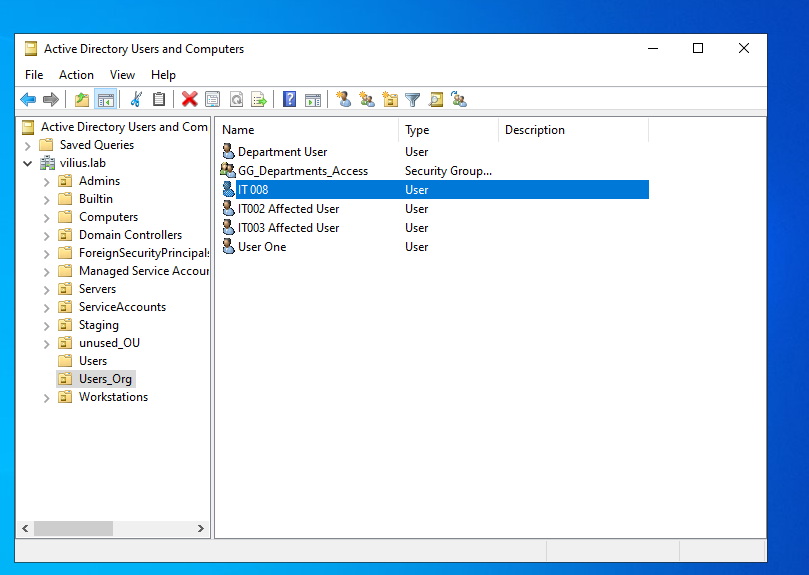
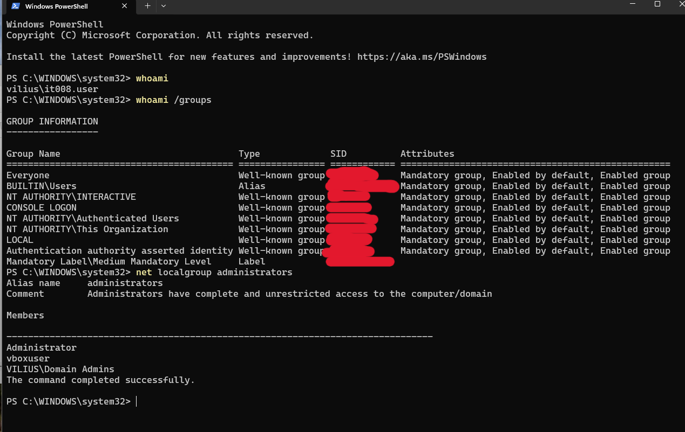
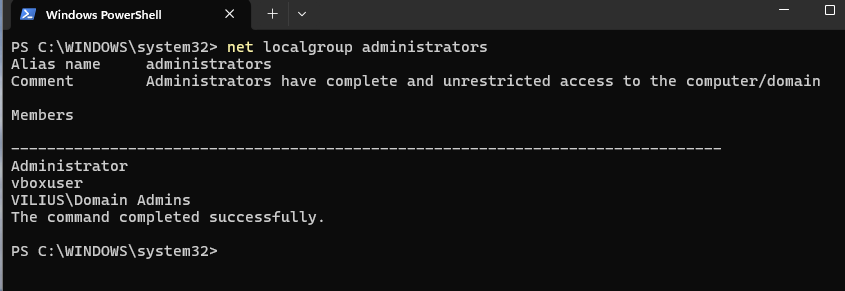
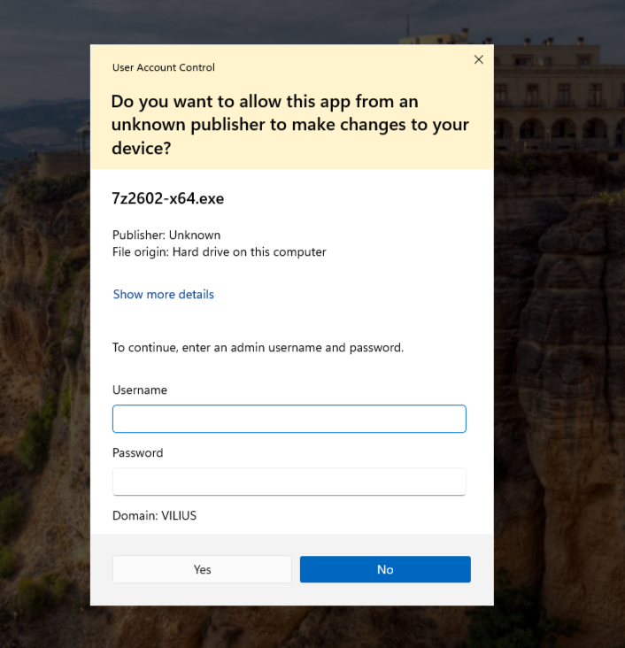
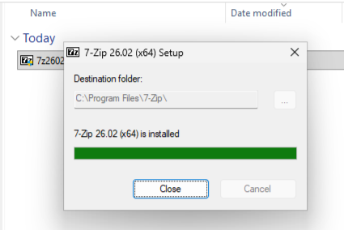
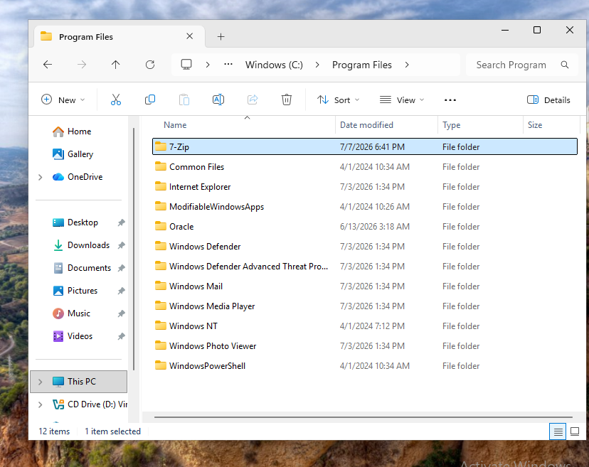
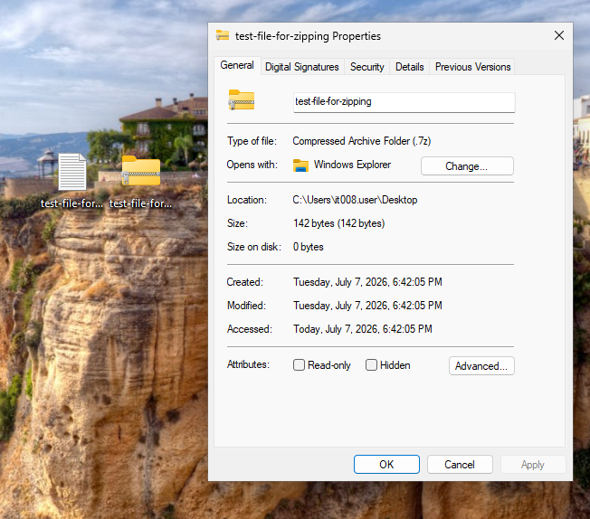

# Investigation: Unable to Install Required Software

## Ticket Summary

`vilius\it008.user` reported that they were unable to install required software on `WIN11-CLIENT01`.

The user could sign in normally, download the installer, and use the workstation, but the installation could not continue without administrator approval.

Affected user:

`vilius\it008.user`

Affected device:

`WIN11-CLIENT01`

Affected software:

`Approved desktop application`

Category:

`Permissions / Software Install`

The investigation focused on confirming the user account, workstation health, local administrator membership, software approval, and whether the installation could be completed using IT administrator approval without giving the user permanent local admin rights.

---

## Lab Environment

Systems involved:

* `WIN11-CLIENT01` - affected workstation
* `DC01` - domain controller / Active Directory management
* `vilius\it008.user` - affected standard domain user
* 7-Zip installer - approved desktop application used for the lab scenario

---

## User Account Created for Scenario

A test user account was created in Active Directory for this scenario.

User account:

`vilius\it008.user`

This account was used to reproduce the software installation issue from the perspective of a standard domain user.

---

## Workstation and User Check

I signed in to `WIN11-CLIENT01` as `vilius\it008.user` and confirmed that the workstation was online.

Commands used:

* `hostname`
* `whoami`
* `ping 10.10.10.10`

The workstation returned the expected hostname, the signed-in user was `vilius\it008.user`, and the workstation could reach the domain controller.

This confirmed that the issue was not caused by a general workstation or network outage.

---

## Local Administrator Membership Check

Next, I checked whether `vilius\it008.user` had local administrator rights on `WIN11-CLIENT01`.

Commands used:

* `whoami /groups`
* `net localgroup administrators`

The local Administrators group did not include `vilius\it008.user`.

This confirmed that the user was a standard user and did not have permission to install software that required elevation.

---

## Installer Requires Administrator Approval

The user attempted to run the approved software installer.

Windows displayed a User Account Control prompt asking for administrator credentials.

This matched the reported issue. The installer required elevation, and the affected user could not continue because they did not have local administrator rights.

---

## Software Approval Review

Before completing the installation, I verified that the requested application was approved for this lab scenario.

The approval note is documented separately in:

`approval.md`

* [Approval](approval.md) 

The installation was approved with the condition that IT would complete the install using administrator approval and the user would remain a standard user afterward.

---

## Root Cause

`vilius\it008.user` was unable to install the software because the installer required administrator privileges.

The user was not a member of the local Administrators group on `WIN11-CLIENT01`, which is expected for a standard domain user.

Root cause:

`The approved installer required elevation, but vilius\it008.user did not have local administrator rights on WIN11-CLIENT01.`

This was a permissions issue, not a workstation, network, or installer download issue.

---

## Fix

The software installation was completed using administrator approval.

The user was not added to the local Administrators group.

This followed least-privilege practice: IT completed the approved installation, while the user remained a standard user.

---

## Installation Validation

After installation, I confirmed that the application was installed under `Program Files`.

I also confirmed that the software worked by creating a test archive with 7-Zip.

This confirmed that the application was installed successfully and usable by the affected user.

---

## Conclusion

The issue was resolved by installing the approved software with administrator approval.

`vilius\it008.user` was a standard domain user and did not have local administrator rights, so the installer could not continue without elevated credentials. After confirming the software was approved, IT completed the installation without granting the user permanent local admin rights.

The software was installed successfully and its functionality was confirmed.

---

## Evidence Summary

| Evidence | Screenshot |
|---|---|
| IT008 user account created in Active Directory | `screenshots/01-it008-user-created-in-active-directory.png` |
| User signed in and workstation was online | `screenshots/02-user-signed-in-workstation-online.png` |
| User was not a local administrator | `screenshots/03-user-not-local-administrator.png` |
| Installer required administrator approval | `screenshots/04-installer-requires-administrator-approval.png` |
| Installation completed with admin approval | `screenshots/05-installation-completed-with-admin-approval.png` |
| Software installed under Program Files | `screenshots/06-software-installed-in-program-files.png` |
| Software functionality confirmed | `screenshots/07-software-functionality-confirmed.png.png` |
